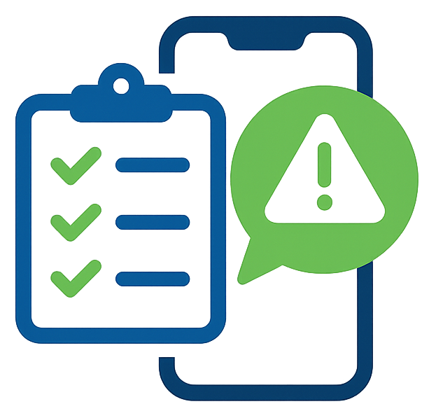
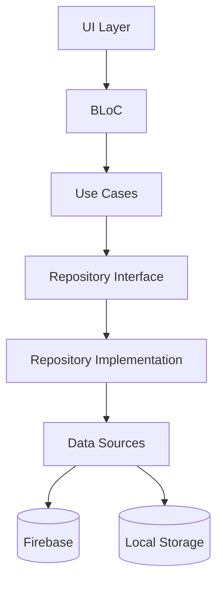

# 📱 Complaints Manager

<div align="center">



**A comprehensive Flutter application for managing logistics complaints and tasks with role-based access control**

[](https://flutter.dev/)
[](https://dart.dev/)
[](https://firebase.google.com/)
[](LICENSE)

[Features](#-features) • [Installation](#-installation) • [Usage](#-usage) • [Architecture](#-architecture) • [Contributing](#-contributing)

</div>

## 📋 Table of Contents

- [Overview](#-overview)
- [Features](#-features)
- [Screenshots](#-screenshots)
- [Architecture](#-architecture)
- [Technologies Used](#-technologies-used)
- [Installation](#-installation)
- [Configuration](#-configuration)
- [Usage](#-usage)
- [API Documentation](#-api-documentation)
- [Testing](#-testing)
- [Deployment](#-deployment)
- [Contributing](#-contributing)
- [License](#-license)
- [Support](#-support)

## 🌟 Overview

Complaints Manager is a modern, cross-platform Flutter application designed for efficient management of logistics complaints and tasks. Built with Clean Architecture principles and BLoC pattern, it provides a robust solution for teams to track, manage, and resolve operational issues.

### 🎯 Key Highlights

- **Multi-Platform**: Runs on Android, iOS, and Web
- **Role-Based Access**: Employee, Manager, and Admin roles with different permissions
- **Real-Time Updates**: Live notifications and task status updates
- **Category Management**: Organized complaint categories for better workflow
- **Analytics Dashboard**: Comprehensive insights and reporting
- **Offline Support**: Works seamlessly without internet connection
- **Secure Authentication**: Firebase Auth with proper security measures

## ✨ Features

### 👥 User Management
- **Role-based authentication** (Employee, Manager, Admin)
- **Category-specific manager assignments**
- **User profile management**
- **Team-based organization**
- **Secure login/logout with session management**

### 📝 Task Management
- **Create and submit complaints** with images
- **Task categorization** (Logistics, Maintenance, Tools, etc.)
- **Priority levels** (Urgent, High, Normal, Low)
- **Status tracking** (Pending, In Progress, Completed, Cancelled)
- **Manager assignment and notes**
- **Real-time status updates**

### 📊 Dashboard & Analytics
- **Interactive analytics dashboard**
- **Task statistics and trends**
- **Category-wise reporting**
- **Priority-based filtering**
- **Completion rate tracking**
- **Team performance metrics**

### 🔔 Notifications
- **Real-time push notifications**
- **Role-based notification filtering**
- **Task status change alerts**
- **Assignment notifications**
- **Unread notification badges**

### 📱 Additional Features
- **Responsive design** for all screen sizes
- **Dark/Light theme support** (planned)
- **Offline data synchronization**
- **Image upload with compression**
- **Search and filtering capabilities**
- **Export functionality** (planned)

## 📸 Screenshots

<div align="center">

| Login Screen | Employee Dashboard | Manager Dashboard | Task Details |
|:---:|:---:|:---:|:---:|
|  |  |  |  |

| Add Complaint | Analytics | User Management | Notifications |
|:---:|:---:|:---:|:---:|
|  |  |  |  |

</div>

## 🏗️ Architecture

This project follows **Clean Architecture** principles with the **BLoC (Business Logic Component)** pattern for state management.

```
lib/
├── 📁 core/                    # Core utilities and constants
│   ├── constants/              # App constants and configurations
│   ├── error/                  # Error handling and exceptions
│   ├── network/                # Network utilities
│   ├── routes/                 # App routing configuration
│   └── utils/                  # Helper utilities
├── 📁 data/                    # Data layer
│   ├── datasources/            # Remote and local data sources
│   ├── models/                 # Data models with JSON serialization
│   └── repositories/           # Repository implementations
├── 📁 domain/                  # Domain layer
│   ├── entities/               # Business entities
│   ├── repositories/           # Repository interfaces
│   └── usecases/               # Business use cases
├── 📁 presentation/            # Presentation layer
│   ├── blocs/                  # BLoC state management
│   ├── pages/                  # UI screens/pages
│   └── widgets/                # Reusable UI components
└── 📄 injection_container.dart # Dependency injection setup
```

### 🔄 Data Flow



## 🛠️ Technologies Used

### 🚀 Framework & Language
- **Flutter** 3.8.1+ - Cross-platform mobile framework
- **Dart** 3.8.1+ - Programming language

### 🏗️ Architecture & State Management
- **Clean Architecture** - Separation of concerns
- **BLoC Pattern** - Predictable state management
- **Get It** - Dependency injection
- **Equatable** - Value equality

### 🔥 Backend Services
- **Firebase Auth** - User authentication
- **Cloud Firestore** - NoSQL database
- **Firebase Storage** - File storage
- **Firebase Cloud Messaging** - Push notifications

### 🎨 UI & UX
- **Material Design 3** - Modern UI components
- **Cached Network Image** - Image loading and caching
- **FL Chart** - Beautiful charts and analytics
- **Flutter Spinkit** - Loading animations

### 🔧 Additional Libraries
- **HTTP/Dio** - Network requests
- **Shared Preferences** - Local data persistence
- **Image Picker** - Camera and gallery access
- **Permission Handler** - App permissions
- **Intl** - Internationalization
- **Connectivity Plus** - Network status

## 📦 Installation

### Prerequisites

- Flutter SDK (3.8.1 or later)
- Dart SDK (3.8.1 or later)
- Android Studio / VS Code
- Firebase project setup

### 🔧 Setup Steps

1. **Clone the repository**
   ```bash
   git clone https://github.com/yourusername/complaints-manager.git
   cd complaints-manager
   ```

2. **Install dependencies**
   ```bash
   flutter pub get
   ```

3. **Configure Firebase**
   - Create a Firebase project at [Firebase Console](https://console.firebase.google.com/)
   - Enable Authentication, Firestore, and Cloud Messaging
   - Download and add configuration files:
     - `google-services.json` for Android
     - `GoogleService-Info.plist` for iOS
     - Update `firebase_options.dart`

4. **Set up Cloudinary (for image uploads)**
   ```bash
   # Add your Cloudinary credentials to environment variables
   export CLOUDINARY_CLOUD_NAME="your_cloud_name"
   export CLOUDINARY_API_KEY="your_api_key"
   export CLOUDINARY_API_SECRET="your_api_secret"
   ```

5. **Run the application**
   ```bash
   # For mobile
   flutter run
   
   # For web
   flutter run -d chrome
   ```

## ⚙️ Configuration

### Firebase Configuration

1. **Authentication**: Enable Email/Password authentication in Firebase Console
2. **Firestore**: Set up collections with proper security rules:
   ```javascript
   // Firestore Security Rules
   rules_version = '2';
   service cloud.firestore {
     match /databases/{database}/documents {
       match /users/{userId} {
         allow read, write: if request.auth != null;
       }
       match /tasks/{taskId} {
         allow read, write: if request.auth != null;
       }
       match /notifications/{notificationId} {
         allow read, write: if request.auth != null;
       }
     }
   }
   ```

3. **Storage Rules**:
   ```javascript
   rules_version = '2';
   service firebase.storage {
     match /b/{bucket}/o {
       match /{allPaths=**} {
         allow read, write: if request.auth != null;
       }
     }
   }
   ```

### Environment Variables

Create a `.env` file in the root directory:

```env
# Firebase Configuration
FIREBASE_API_KEY=your_api_key
FIREBASE_PROJECT_ID=your_project_id
FIREBASE_MESSAGING_SENDER_ID=your_sender_id
FIREBASE_APP_ID=your_app_id

# Cloudinary Configuration
CLOUDINARY_CLOUD_NAME=your_cloud_name
CLOUDINARY_API_KEY=your_api_key
CLOUDINARY_API_SECRET=your_api_secret
```

## 📖 Usage

### 👤 User Roles

#### **Employee**
- Submit new complaints with images
- View own submitted tasks
- Track task status and updates
- Receive notifications on task progress

#### **Manager**
- View assigned category tasks
- Update task status and add notes
- Assign tasks to team members
- Access analytics for assigned categories

#### **Admin**
- Full system access
- User management capabilities
- Category assignment to managers
- System-wide analytics and reporting

### 🔄 Workflow

1. **Employee submits a complaint**
   - Select category and priority
   - Add description and images
   - Submit for manager review

2. **Manager receives notification**
   - Reviews the complaint
   - Updates status and adds notes
   - Assigns to appropriate team member

3. **Real-time updates**
   - All stakeholders receive notifications
   - Status changes are reflected immediately
   - Analytics are updated in real-time

## 🔌 API Documentation

### Authentication Endpoints

```dart
// Login
Future<Either<Failure, AppUser>> login({
  required String email,
  required String password,
});

// Register
Future<Either<Failure, AppUser>> register({
  required String email,
  required String password,
  required String name,
  required String role,
  required String team,
});
```

### Task Management Endpoints

```dart
// Create Task
Future<Either<Failure, Task>> createTask(Task task);

// Get Tasks
Future<Either<Failure, List<Task>>> getTasks({
  String? status,
  String? priority,
  String? category,
});

// Update Task
Future<Either<Failure, Task>> updateTask(Task task);
```

## 🧪 Testing

### Running Tests

```bash
# Unit tests
flutter test

# Widget tests
flutter test test/widget_test.dart

# Integration tests
flutter test integration_test/
```

### Test Coverage

```bash
# Generate coverage report
flutter test --coverage
genhtml coverage/lcov.info -o coverage/html
```

### Test Structure

```
test/
├── unit/
│   ├── domain/
│   ├── data/
│   └── presentation/
├── widget/
└── integration/
```

## 🚀 Deployment

### Android Deployment

1. **Build APK**
   ```bash
   flutter build apk --release
   ```

2. **Build App Bundle**
   ```bash
   flutter build appbundle --release
   ```

### iOS Deployment

1. **Build iOS**
   ```bash
   flutter build ios --release
   ```

2. **Archive in Xcode**
   ```bash
   open ios/Runner.xcworkspace
   ```

### Web Deployment

1. **Build for Web**
   ```bash
   flutter build web --release
   ```

2. **Deploy to Firebase Hosting**
   ```bash
   firebase deploy
   ```

## 🤝 Contributing

We welcome contributions! Please see our [Contributing Guide](CONTRIBUTING.md) for details.

### Development Setup

1. Fork the repository
2. Create a feature branch (`git checkout -b feature/amazing-feature`)
3. Follow the coding standards and architecture patterns
4. Write tests for new functionality
5. Commit your changes (`git commit -m 'Add amazing feature'`)
6. Push to the branch (`git push origin feature/amazing-feature`)
7. Open a Pull Request

### Code Style

- Follow [Flutter Style Guide](https://flutter.dev/docs/development/ui/layout/responsive)
- Use meaningful variable and function names
- Add comments for complex business logic
- Maintain Clean Architecture principles

## 📄 License

This project is licensed under the MIT License - see the [LICENSE](LICENSE) file for details.

## 🆘 Support

### Getting Help

- 📧 Email: [your-email@domain.com](mailto:your-email@domain.com)
- 💬 GitHub Issues: [Create an issue](https://github.com/yourusername/complaints-manager/issues)
- 📖 Documentation: [Wiki](https://github.com/yourusername/complaints-manager/wiki)

### Frequently Asked Questions

**Q: How do I reset my password?**
A: Use the "Forgot Password" link on the login screen.

**Q: Can managers see all tasks?**
A: Managers can only see tasks from their assigned categories. Admins see all tasks.

**Q: How do I upload images?**
A: Tap the camera icon when creating a complaint and select from camera or gallery.

**Q: Is offline support available?**
A: Yes, the app works offline and syncs when connection is restored.

---

<div align="center">

**Made with ❤️ by BeNext**

[](https://github.com/yourusername/complaints-manager/stargazers)
[](https://github.com/yourusername/complaints-manager/network)
[](https://github.com/yourusername/complaints-manager/issues)

</div>
